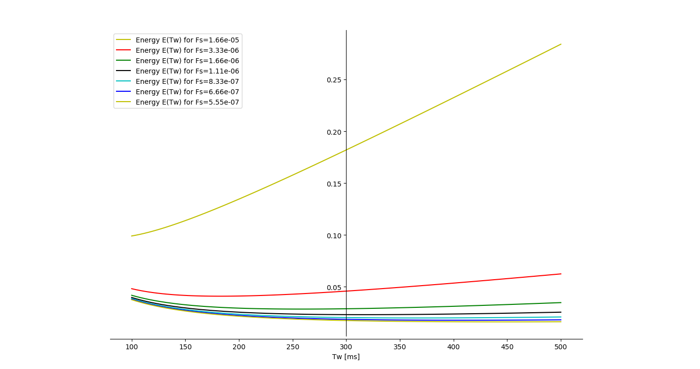
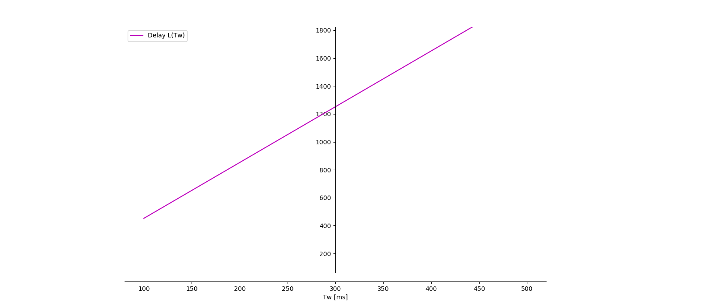
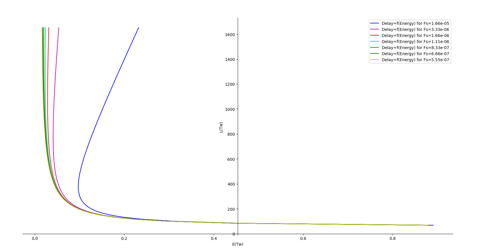
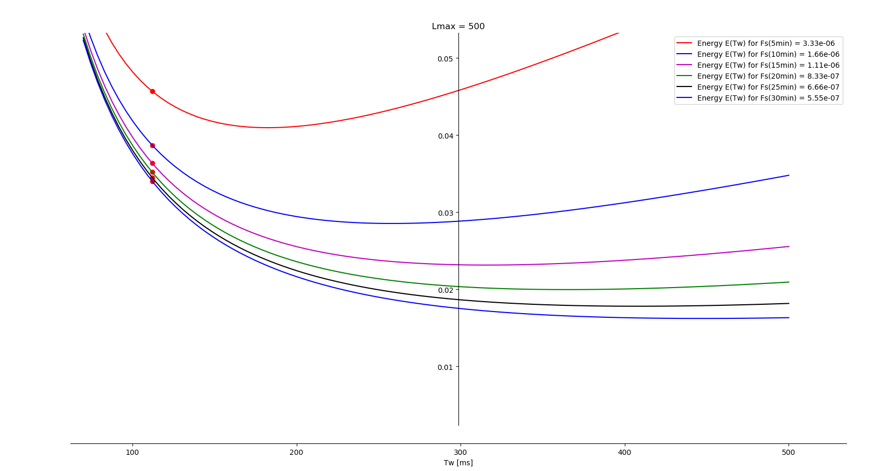
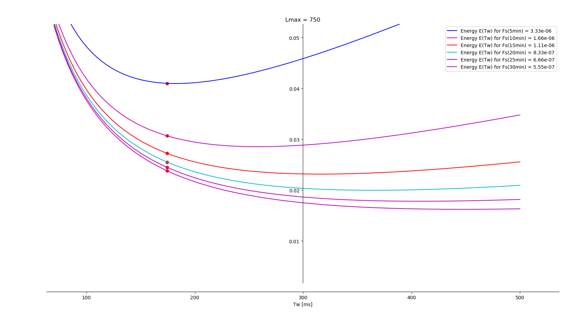
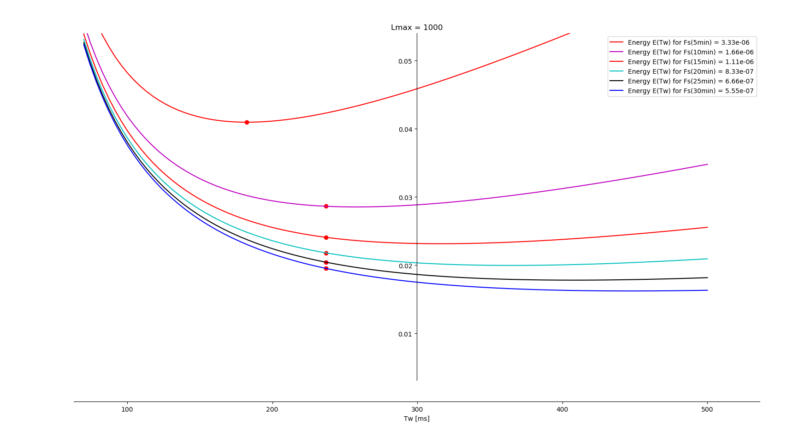
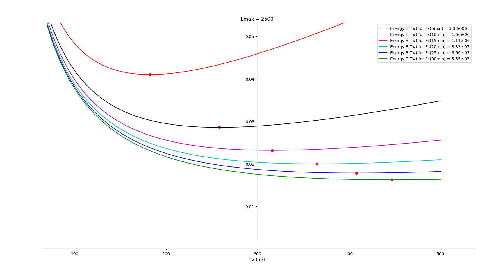
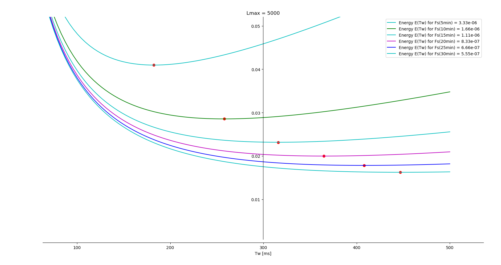
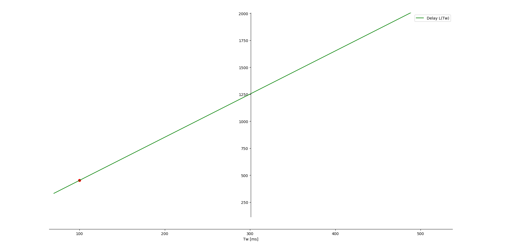
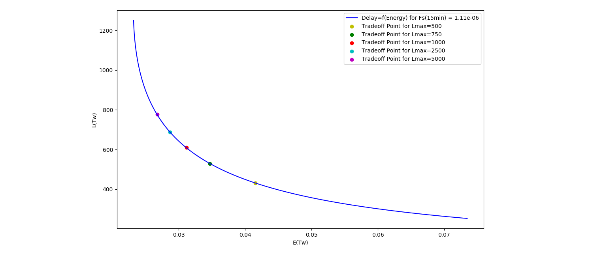

# Energy optimization wireless sensor network
Optimization of energy consumption and end to end delay in a wireless sensor network using duty-cycle MAC protocols  

## About
**Author**  
Marcel Cases i Freixenet &lt;marcel.cases@estudiantat.upc.edu&gt;

**Course**  
Topics on Optimization and Machine Learning (TOML-MIRI)  
FIB - Universitat Politècnica de Catalunya. BarcelonaTech  
May 2021 

## Exercises

### Exercise 1

Definition of Network Energy Consumption for XMAC protocols:

````python
d = 1 # first ring
α1 = Tcs + Tal + (3/2)*Tps*((Tps + Tal)/2 + Tack + Tdata)*FB(d)
α2 = Fout(d)/2
α3 = ((Tps + Tal)/2 + Tcs + Tal + Tack + Tdata)*Fout(d) + ((3/2)*Tps + Tack + Tdata)*FI(d) + (3/4)*Tps*FB(d)

E = lambda Tw: α1/Tw + α2*Tw + α3
````

Definition of End-to-End Delay for XMAC protocols:

````python
d = D # last ring
β1 = sum(1/2 for i in range(1, d+1))
β2 = sum(Tcw/2 + Tdata for i in range(1, d+1))

L = lambda Tw: β1*Tw + β2
````

The definition of each parameter or function is in the source code at the end of the document.

#### (a)

The following plot shows the curve of the energy function for different values of `Fs` (sampling frequency). It represents the energy as a function of `Tw`, where `Tw` = [`Twmin`, `Twmax`] = [100, 500] ms.



#### (b)

The following plot shows the curve of the delay as a function of Tw. This linear function depends on `β1` and `β2`, and is the same for any value of `Fs`.



#### (c)

This is the curve `E(Tw)`-`L(Tw)` (delay as a function of the energy) for different sampling frequencies `Fs`.




### Exercise 2

#### (P1)

In this geometric optimization problem, Python's `gpkit` solver has been used to obtain **optimal values for the energy function**. It has been executed for different values of `Lmax`, and for each run, the energy function uses different values for `Fs` as well.

The problem requires to use the node where the most traffic rate is located, which is the one closest to the sink `d=1` (inner ring).

The model to be optimized has been implemented to the solver in the following way:

````python
objective = E(Tw)
constraints = [ L(Tw) <= Lmax,
                Tw >= Tw_min,
                Id(0)*Etx(1,Tw) <= 1/4
                ]
m = Model(objective, constraints)
````

The definition of each parameter or function is in the source code at the end of the document.

For values of `Lmax` &le; 100, the optimization problem turns out infeasible.

**For `Lmax` = 500**:



| Time [min] | Optimal Cost E(Tw)* | Tw* value | Most Sensitive Constraints |
|------------|---------------------|-----------|----------------------------|
| Fs(5min)   | 0.04568             | 112       | +0.43 : 4*Tw + 52 <= 500   |
| Fs(10min)  | 0.03869             | 112       | +0.66 : 4*Tw + 52 <= 500   |
| Fs(15min)  | 0.03636             | 112       | +0.76 : 4*Tw + 52 <= 500   |
| Fs(20min)  | 0.0352              | 112       | +0.82 : 4*Tw + 52 <= 500   |
| Fs(25min)  | 0.0345              | 112       | +0.85 : 4*Tw + 52 <= 500   |
| Fs(30min)  | 0.03403             | 112       | +0.87 : 4*Tw + 52 <= 500   |

**For `Lmax` = 750**:



| Time [min] | Optimal Cost E(Tw)* | Tw* value | Most Sensitive Constraints |
|------------|---------------------|-----------|----------------------------|
| Fs(5min)   | 0.04099             | 174.5     | +0.042 : 4*Tw + 52 <= 750  |
| Fs(10min)  | 0.03067             | 174.5     | +0.36 : 4*Tw + 52 <= 750   |
| Fs(15min)  | 0.02723             | 174.5     | +0.52 : 4*Tw + 52 <= 750   |
| Fs(20min)  | 0.02551             | 174.5     | +0.62 : 4*Tw + 52 <= 750   |
| Fs(25min)  | 0.02448             | 174.5     | +0.68 : 4*Tw + 52 <= 750   |
| Fs(30min)  | 0.02379             | 174.5     | +0.72 : 4*Tw + 52 <= 750   |

**For `Lmax` = 1000**:



| Time [min] | Optimal Cost E(Tw)* | Tw* value | Most Sensitive Constraints  |
|------------|---------------------|-----------|-----------------------------|
| Fs(5min)   | 0.04096             | 182.4     | (none)                      |
| Fs(10min)  | 0.02864             | 237       | +0.082 : 4*Tw + 52 <= 1e+03 |
| Fs(15min)  | 0.02408             | 237       | +0.27 : 4*Tw + 52 <= 1e+03  |
| Fs(20min)  | 0.02181             | 237       | +0.4 : 4*Tw + 52 <= 1e+03   |
| Fs(25min)  | 0.02044             | 237       | +0.49 : 4*Tw + 52 <= 1e+03  |
| Fs(30min)  | 0.01953             | 237       | +0.55 : 4*Tw + 52 <= 1e+03  |

**For `Lmax` = 2500**:



| Time [min] | Optimal Cost E(Tw)* | Tw* value | Most Sensitive Constraints |
|------------|---------------------|-----------|----------------------------|
| Fs(5min)   | 0.04096             | 182.4     | (none)                     |
| Fs(10min)  | 0.02854             | 258       | (none)                     |
| Fs(15min)  | 0.02315             | 316       | (none)                     |
| Fs(20min)  | 0.01997             | 364.9     | (none)                     |
| Fs(25min)  | 0.01781             | 407.9     | (none)                     |
| Fs(30min)  | 0.01623             | 446.9     | (none)                     |

**For `Lmax` = 5000**:



| Time [min] | Optimal Cost E(Tw)* | Tw* value | Most Sensitive Constraints |
|------------|---------------------|-----------|----------------------------|
| Fs(5min)   | 0.04096             | 182.4     | (none)                     |
| Fs(10min)  | 0.02854             | 258       | (none)                     |
| Fs(15min)  | 0.02315             | 316       | (none)                     |
| Fs(20min)  | 0.01997             | 364.9     | (none)                     |
| Fs(25min)  | 0.01781             | 407.9     | (none)                     |
| Fs(30min)  | 0.01623             | 446.9     | (none)                     |

#### (P2)

In this section, the same solver has been used to obtain **optimal values for the delay function**. It has been executed for different values of `Ebudget`, as well as different `Fs`, but the resulting graph and the optimal value remain the same. `Fs` has no positive or negative impact on the delay.

The problem requires to use the last node of the system `d=D` (outer ring), where the least traffic rate is located, and will have the highest delay (worst case).

The model to be optimized has been implemented to the solver in the following way:

````python
objective = L(Tw)
constraints = [ E(Tw) <= Ebudget,
                Tw >= Tw_min,
                Id(0)*Etx(1,Tw) <= 1/4
                ]
m = Model(objective, constraints)
````

The definition of each parameter or function is in the source code at the end of the document.

**Optimal Cost `L(Tw)*` = 452**  
**`Tw*` = 100**



### Exercise 3

Following a Nash Bargaining Solution (NBS), two players (energy `E(Tw)` and delay `L(Tw)`) are demanding some wake-up time `Tw` in order to decide how much energy will be used in transmitting and receiving messages among nodes (Duty cycle) and how long the XMAC protocol will be delayed between two messages. They have to collaborate and reach an agreement to avoid getting their worst pay-off.

The problem has been transformed from a non-linear, non-convex problem into a concave problem, and by making the objective function negative, it can be treated as a convex minimization problem and can be solved using `SciPy`'s optimization module.

The Python model for the NBS is the following:

````python
fun = lambda E1, L1: -np.log(Eworst-E1) -np.log(Lworst-L1) # Objective function

cons = ({'type': 'ineq', 'fun': lambda Tw: Eworst - E(Tw)}, # constraints
        {'type': 'ineq', 'fun': lambda E1, Tw: E1 - E(Tw)},
        {'type': 'ineq', 'fun': lambda Tw: Lworst - L(Tw)},
        {'type': 'ineq', 'fun': lambda L1, Tw: L1 - L(Tw)},
        {'type': 'ineq', 'fun': lambda Tw: Tw - Tw_min},
        {'type': 'ineq', 'fun': lambda Tw: 1/4 - Id(0)*Etx(1,Tw)}
        )

bnds = ((None, None), )*1 # bounds

x0 = 0 # initial guess

# Method SLSQP uses Sequential Least SQuares Programming to minimize a function 
# of several variables with any combination of bounds, equality and inequality constraints. 
res = minimize(fun, x0, method='SLSQP', bounds=bnds, constraints=cons
````

For simplicity, the NBS has been executed for the case `Fs(15min)`. For each value of `Lmax`, the following results have been obtained:

| Lmax [ms] | E(Tw)   | L(Tw) |
|-----------|---------|-------|
| 500       | 0.04155 | 431.1 |
| 750       | 0.03467 | 529.0 |
| 1000      | 0.03114 | 610.2 |
| 2500      | 0.02869 | 687.2 |
| 5000      | 0.02676 | 776.7 |

Graphically, the solution to the NBS problem is the following:



## Source code

You can check out the source code used for solving the problems as well as to plot the graphs on the GitHub repo:  
[github.com/marcelcases/energy-optimization-wireless-sensor-network](https://github.com/marcelcases/energy-optimization-wireless-sensor-network)

## References
Task statement  
Hanz Rodríguez Ramos. *The deployment of extra relay nodes around the sink in order to solve the energy imbalanced problem in Wireless Sensor Networks*  
M. Doudou, J. M. Barcelo-Ordinas, D. Djenouri, J. Garcia-Vidal, A. Bouabdallah, and N. Badache. *Game theory framework for mac parameter optimization in energy-delay constrained sensor networks*  
GPkit documentation [gpkit.readthedocs.io/en/latest/](https://gpkit.readthedocs.io/en/latest/)  
